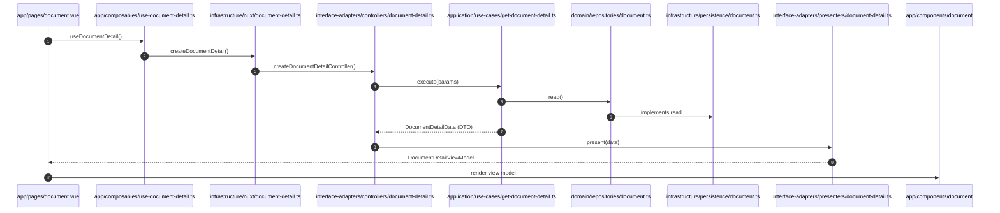

# Infrastructure Layer

The `infrastructure/` layer implements external details: HTTP, persistence, Markdown, logging, and the Nuxt composition root. It is the only layer allowed to depend on frameworks and third-party libraries, but every concrete implementation must enter the inner layers through an application port or domain repository abstraction.

## Current state

`infrastructure/` is an **empty scaffold**. `config/`, `http/`, `logging/`, and `markdown/` contain README placeholders only; `nuxt/` and `persistence/` are empty directories. The historical example files (`infrastructure/nuxt/home-page.ts`, `infrastructure/persistence/in-memory-home-content.ts`) were removed in commit `301a6ff`.

| Directory | README contract |
| --- | --- |
| `config/` | Runtime configuration adaptation |
| `http/` | HTTP driver / client implementation |
| `markdown/` | Milkdown is the unified Markdown editing/rendering driver; concrete wiring stays here, the kernel depends only on abstractions |
| `persistence/` | Database, cache, and in-memory implementations (empty) |
| `logging/` | Logging driver implementation |
| `nuxt/` | Nuxt composition root: assembles repositories, use cases, and controllers |

## Composition root pattern

The composition root is where concrete dependencies get assembled. [clean-architecture.md](/docs/architecture/clean-architecture.md) gives the example: a document-detail page would be served by `infrastructure/nuxt/document-detail.ts`, which creates the repository, use case, and controller and returns a composable entry point. When the API or database changes, only the composition root and the repository implementation change — `domain` and `application` stay untouched. Pages must never `new InMemoryDocument()` or similar directly.

## Milkdown confinement

Milkdown packages are locked as direct dependencies (`@milkdown/core`, `@milkdown/vue`, `@milkdown/preset-commonmark`, `@milkdown/preset-gfm`, `@milkdown/plugin-history`, all `^7.22.1`) but no editor feature is wired yet. AGENTS.md and [clean-architecture.md](/docs/architecture/clean-architecture.md) require all Milkdown business flows to live under `infrastructure/markdown`; Milkdown types and instances must never enter `domain`/`application`. The intended encapsulation file is `markdown/milkdown.ts` (qualified name because it expresses the third-party implementation).

## Intended business call chain

The canonical "document detail" chain from [clean-architecture.md](/docs/architecture/clean-architecture.md) shows every participant and its replacement point:

*Full document-detail call chain across the Clean Architecture layers, as specified in docs/architecture/clean-architecture.md.*

Replacement points, per the same document: pages can swap without touching use cases; the in-memory store can be replaced by an API or database without touching domain/application; view models can change presentation without touching entities; Milkdown stays encapsulated in `infrastructure/markdown`.

## Extension point

For a new feature: (1) implement the concrete data source in `persistence/` or `http/`, (2) create the composition root in `nuxt/` that wires repository → use case → controller, and (3) expose it through a composable. The step list is on the [Development Workflow](/openwiki/workflows/development-workflow.md) page; the controllers/presenters it drives live in the [Interface-Adapters layer](/openwiki/architecture/interface-adapters-layer.md).

## Focused validation

Infrastructure is validated through the use case and presenter tests with real dependencies (the historical `tests/unit/get-home-page-content.test.ts` instantiated the in-memory store and the use case together). Because no infrastructure code exists yet, there are no current tests; new implementations must come with failing-first tests per AGENTS.md (see [Unit Testing](/openwiki/testing/unit-testing.md)).
