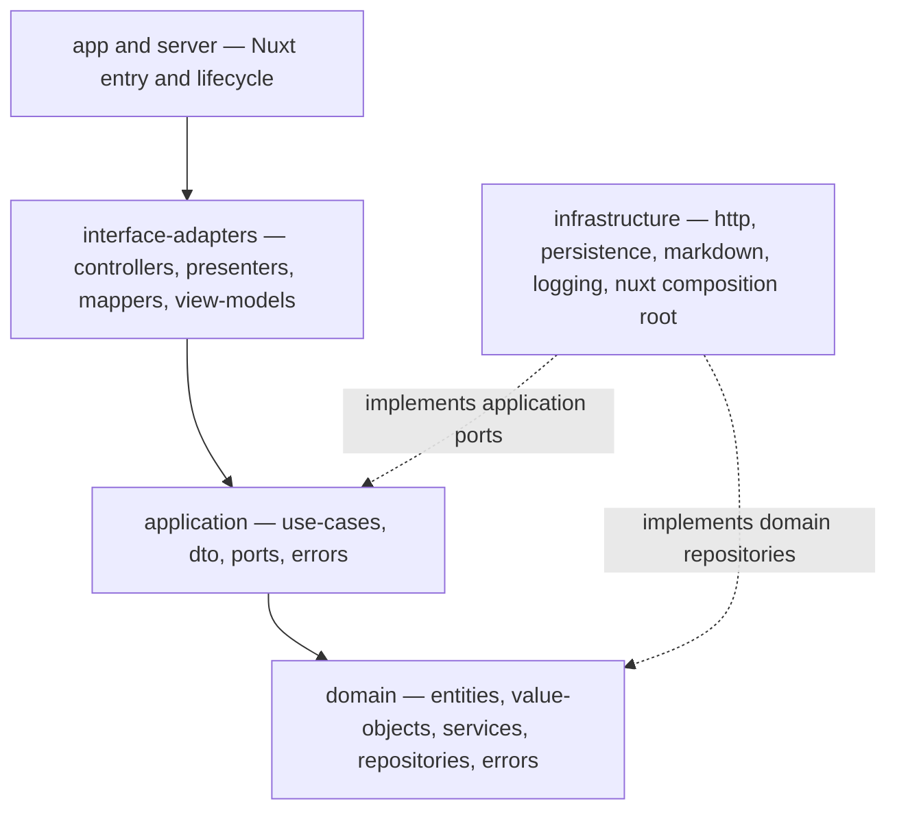

# Architecture Overview

`knowledgebase-ui` is a Yuque-like (类语雀) knowledge-base web UI for the TUST Open Atom Open Source Association (天津科技大学开放原子开源协会), built on Nuxt 4, Vue 3, and TypeScript. The repository is intentionally a long-lived collaboration **skeleton**: the implemented surface today is a polished presentation shell (card navigation, WebGL visual components, global theming) plus a strict tooling and verification contract, while the business core is represented by empty Clean Architecture scaffolds whose contracts are documented in [AGENTS.md](/AGENTS.md) and [docs/architecture/clean-architecture.md](/docs/architecture/clean-architecture.md).

## System composition

The repository is split into three cooperating groups:

1. **Nuxt convention directories** — `app/` (presentation), `server/` (Nuxt server entrypoints), `shared/` (side-effect-free code usable by both). See [Nuxt Convention Directories](/openwiki/architecture/nuxt-conventions.md).
2. **Clean Architecture layers** — `domain/`, `application/`, `interface-adapters/`, `infrastructure/` at the repository root. All four are currently **empty scaffolds** (README-only or empty directories); the README placeholders in empty directories exist solely so Git can track the directories (per [docs/plans/2026-08-14-knowledgebase-skeleton.md](/docs/plans/2026-08-14-knowledgebase-skeleton.md)) and must never contain business logic. The historical home-page example that exercised them was removed in commit `301a6ff` (refactor(architecture): 移除首页示例死链，回归占位骨架). Each layer has a dedicated page: [Domain](/openwiki/architecture/domain-layer.md), [Application](/openwiki/architecture/application-layer.md), [Interface-Adapters](/openwiki/architecture/interface-adapters-layer.md), [Infrastructure](/openwiki/architecture/infrastructure-layer.md).
3. **Tooling and verification** — package scripts, ESLint/Prettier, commit message validation, husky hooks, and GitHub Actions. See [Project Toolchain](/openwiki/tooling/project-toolchain.md), [Commit Message Validation](/openwiki/tooling/commit-message-validation.md), and [Git Hooks and CI](/openwiki/tooling/hooks-and-ci.md).

## Dependency direction

Dependencies may only point inward; `infrastructure` sits on the outside and implements abstractions owned by inner layers (decision recorded in [ADR-0001](/docs/adr/0001-clean-architecture.md)):



*Layer dependency direction and where `infrastructure` plugs in, as enforced by AGENTS.md and docs/architecture/clean-architecture.md.*

Concrete constraints (from [AGENTS.md](/AGENTS.md)):

- `domain` must not import Vue, Nuxt, Pinia, Milkdown, HTTP clients, or database drivers.
- `application` depends only on `domain` and abstract ports; no pages, routes, browser APIs, or concrete drivers.
- `interface-adapters` performs input/output conversion and never implements enterprise rules.
- `infrastructure` may depend on frameworks and third-party libraries, but concrete implementations must enter through ports or repository abstractions.
- `app/pages` only composes composables and components; concrete dependency assembly lives in the `infrastructure` composition root.

## Root path aliases

`nuxt.config.ts` defines four absolute-path aliases so business layers can be imported without deep relative paths. The aliases solve paths only; they do not change dependency direction:

| Alias | Target | Purpose |
| --- | --- | --- |
| `@domain` | `./domain` | Domain layer imports |
| `@application` | `./application` | Application layer imports |
| `@interface-adapters` | `./interface-adapters` | Adapter layer imports |
| `@infrastructure` | `./infrastructure` | Infrastructure layer imports |

The aliases are registered in [nuxt.config.ts](/nuxt.config.ts) via `fileURLToPath(new URL('./<layer>', import.meta.url))`. The presentation layer continues to use Nuxt's own `~`/`~~` aliases.

## Intended business call chain

When real business features land, [docs/architecture/clean-architecture.md](/docs/architecture/clean-architecture.md) specifies this chain (document-detail example), which the wiki documents in full on the [Infrastructure Layer](/openwiki/architecture/infrastructure-layer.md) page:

```text
app/pages/document.vue → app/composables/use-document-detail.ts
  → infrastructure/nuxt/document-detail.ts (composition root)
  → interface-adapters/controllers/document-detail.ts
  → application/use-cases/get-document-detail.ts
  → domain/repositories/document.ts
  → infrastructure/persistence/document.ts → interface-adapters/presenters/document-detail.ts
  → app/components/document/*.vue
```

## Current implementation status

| Area | Status | Evidence |
| --- | --- | --- |
| App shell, layout, placeholder pages, error page | Implemented | [App Shell and Routing](/openwiki/presentation/app-shell.md) |
| Aurora, Radar, CardNav, SpecularButton | Implemented | [Custom Visual Components](/openwiki/presentation/visual-components.md) |
| shadcn-vue UI kit | Generated, unused in pages | [shadcn-vue UI Kit](/openwiki/presentation/ui-kit.md) |
| Global theming | Implemented, with legacy dead styles | [Theming and Global Styles](/openwiki/presentation/theming.md) |
| domain/application/interface-adapters/infrastructure | Empty scaffolds | Layer pages linked above |
| server/, shared/, app middleware/plugins/stores | Empty scaffolds with README contracts | [Nuxt Convention Directories](/openwiki/architecture/nuxt-conventions.md) |
| Commit validation, hooks, CI | Implemented and tested | Tooling pages linked above |
| Milkdown editor | Dependencies locked (`@milkdown/*` 7.22.1), no feature wired | [Project Toolchain](/openwiki/tooling/project-toolchain.md) |

## Validation

The narrowest full-skeleton validation is `pnpm run lint:check && pnpm typecheck && pnpm test` (what `pre-push` runs); CI additionally runs `pnpm build`. Individual commands are documented in [Project Toolchain](/openwiki/tooling/project-toolchain.md).
