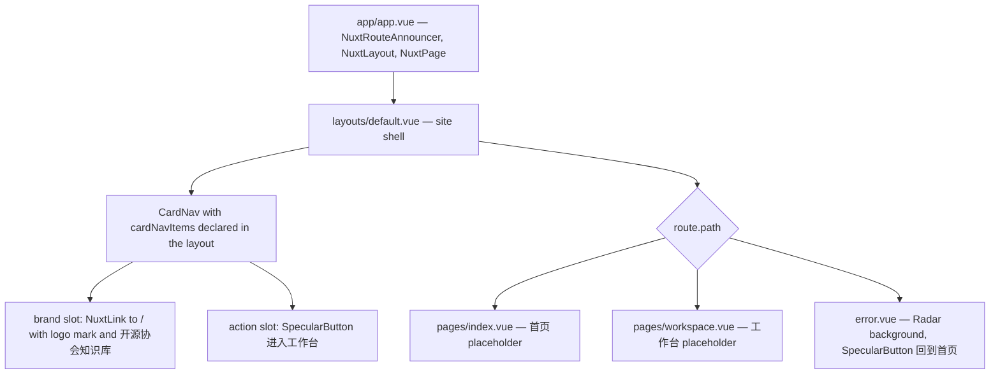

# App Shell and Routing

The presentation shell is the only fully implemented feature surface in the repository. It is intentionally minimal: a brand shell with card navigation around two placeholder routes, plus a dedicated error page.

## Composition

*How a request composes the app root, default layout, and current route/error page.*

## app.vue — application root

`app/app.vue` is three components: `NuxtRouteAnnouncer`, `NuxtLayout`, and `NuxtPage`. There is no root-level business logic.

## layouts/default.vue — the brand shell

[default.vue](/app/layouts/default.vue) owns the whole visible site chrome:

- **Home backdrop**: `isHome = computed(() => route.path === '/')` gates both the backdrop and the body background. When `route.path === '/'`, a fixed, `pointer-events: none` `Aurora` backdrop renders behind the shell inside `.home-aurora-backdrop` with `aria-hidden="true"`; `useHead` additionally sets `bodyAttrs.style = 'background: transparent'` only when `isHome`.
- **CardNav**: the header navigation component receives the exact props `logo="/icon/favicon.svg"`, `logo-alt="开源协会知识库图标"`, `base-color="#ffffff"`, `menu-color="#171b25"`, `class-name="site-card-nav"`. The `brand` slot overrides the default logo image with a `NuxtLink to="/"` (aria-label 返回知识库首页) containing a `.card-nav-brand-mark` span styled `background-image: url('/icon/favicon.svg')` plus the brand name 开源协会知识库; the `action` slot renders a `SpecularButton` (进入工作台) with `size="sm"`, `:radius="12"`, `line-color="#e86f4f"`, `:intensity="0.5"`, `:shine-size="12"`, `:shine-fade="35"`, `:thickness="1.2"`, `:speed="0.35"`, `:proximity="250"`, `:auto-animate="false"` whose `@click` calls `goToWorkspace` → `router.push('/workspace')`.
- **Footer**: fixed two-line association signature (天津科技大学开放原子开源协会 / 让知识在连接中持续生长).
- **Main slot**: `<slot />` hosts the routed page.

The `cardNavItems` array in the layout is currently the *only* content source in the app; card labels, colors (`bgColor`/`textColor`), and links are declared here and consumed by `CardNav`. The exact items:

| label | bgColor | textColor | links |
| --- | --- | --- | --- |
| 关于协会 | `#FFF0E9` | `#8B3A3A` | 示例 (ariaLabel 功能示例占位) × 2 |
| 知识空间 | `#F0E8F7` | `#5A3D6E` | `{ label: '进入工作台', href: '/workspace', ariaLabel: '进入知识工作台' }`, 示例 |
| 联系协会 | `#EEF1F5` | `#3A4A5A` | 示例 (ariaLabel 功能示例占位) × 2 |

## Placeholder pages

`app/pages/index.vue` (首页) and `app/pages/workspace.vue` (工作台) are minimal placeholder sections using the shared `.page-placeholder` global class (see [Theming](/openwiki/presentation/theming.md)). They carry no business logic, per the deliberate skeleton state (commit `c1e61f3` refactor(pages): 简化首页与工作台占位并删除工作台壳层).

## error.vue — the error page

[error.vue](/app/error.vue) renders when a Nuxt error occurs (it replaces the page):

- Props: `error: NuxtError` (statusCode + message).
- Background: a `Radar` WebGL component with `:speed="0.5" :brightness="0.45"`.
- Content: the status code, a fixed title (该页面为示例页或页面不存在), and a `SpecularButton` (回到首页) with `size="md"`, `:radius="16"`, `base-color="#525252"`, `:intensity="1.2"`, `:auto-animate="false"` that calls `clearError({ redirect: '/' })` via `handleClearError`.
- Scoped styles define the `.error-page`, `.error-radar`, `.error-content`, `.error-code`, `.error-title`, `.error-hint` layout.

## Routing facts

- Routes: `/` (index) and `/workspace`; both use the default layout implicitly.
- There is no route middleware, page-level `definePageMeta` overrides, or dynamic routes today (`app/middleware/` is an empty scaffold).
- The only navigation primitive is `router.push('/workspace')` from the layout CTA and the `CardNav` link `href: '/workspace'`.

## Change recipes

- **Edit nav cards**: change `cardNavItems` in `app/layouts/default.vue` (labels, `href`, colors). No other file is affected; `CardNav` takes `items` as a prop.
- **Edit the brand/CTA**: edit the `brand`/`action` slots in the same layout, or the `SpecularButton` props.
- **Add a route**: create `app/pages/<name>.vue`; it automatically renders inside the default layout and the shell. A dedicated page under `app/components/<feature>/` is the convention (see `app/components/home/README.md`).

## Focused validation

There are no unit tests for the shell (it is view-only composition). Manual validation is `pnpm dev` and checking the home page, `/workspace`, and a forced error (narrow screens included), per docs/guides/development-workflow.md. The narrowest automated checks are `pnpm run lint:check` and `pnpm typecheck` (see [Project Toolchain](/openwiki/tooling/project-toolchain.md)).
