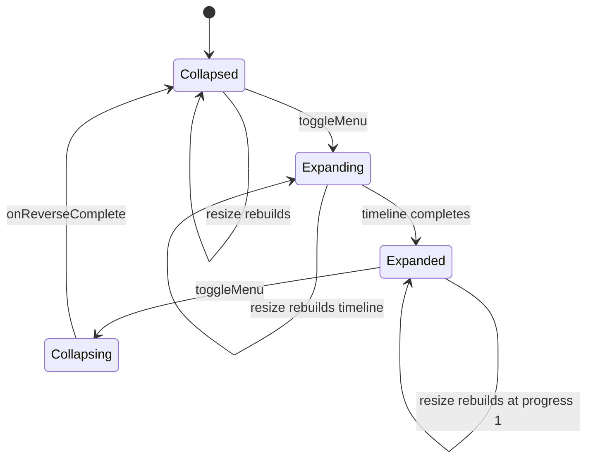

# Custom Visual Components

Four components in `app/components/` are hand-written product code (everything else in the UI kit is generated; see [shadcn-vue UI Kit](/openwiki/presentation/ui-kit.md)). Three of them (Aurora, Radar, SpecularButton) render WebGL through the `ogl` library; CardNav animates with GSAP. They are the entire implemented feature surface of the app and are used by the [App Shell and Routing](/openwiki/presentation/app-shell.md) layout and error page.

| Component | Path | Tech | Used by |
| --- | --- | --- | --- |
| Aurora | `app/components/Aurora/Aurora.vue` | ogl, GLSL 300 es | Home backdrop (`layouts/default.vue` when route is `/`) |
| Radar | `app/components/Radar/Radar.vue` | ogl, GLSL 100 | Error page background (`app/error.vue`) |
| CardNav | `app/components/CardNav/CardNav.vue` | GSAP timeline | Header navigation (`layouts/default.vue`) |
| SpecularButton | `app/components/SpecularButton/SpecularButton.vue` | ogl, GLSL 300 es | Layout CTA and error page button |

ESLint ignores the `CardNav` and `SpecularButton` directories (`eslint.config.mjs`) as upstream-maintained style code; the project only lints its own wrapper usage.

## Shared WebGL pattern

Aurora, Radar, and SpecularButton share the same lifecycle shape, which is worth understanding once:

1. **Mount**: `onMounted` creates an `ogl` `Renderer` (with `alpha: true`), a `Triangle` geometry, and a `Program` carrying the GLSL shader and prop-derived uniforms. If the geometry carries a `uv` attribute the component deletes it (screen-space rendering needs no UVs).
2. **Canvas attach**: `gl.canvas` is appended to the component's container div (the container is styled `width/height: 100%`).
3. **Loop**: a `requestAnimationFrame` loop (`update(now)`) writes time and animated values into `program.uniforms` and calls `renderer.render({ scene: mesh })` every frame.
4. **Resize**: a `window` `resize` listener (or `ResizeObserver`) updates renderer size and `uResolution`.
5. **Cleanup**: on unmount (and on prop-change teardown), the animation frame is cancelled, listeners removed, the canvas removed from the DOM, and `gl.getExtension('WEBGL_lose_context')?.loseContext()` releases the context. Prop changes trigger `cleanup()` then `setup()` again (Radar watches its full prop list; Aurora reads props each frame instead).

## Aurora.vue — aurora backdrop

A full-screen aurora rendered by a fragment shader (`FRAG`) that combines a simplex-noise height field with a three-stop color ramp (`COLOR_RAMP` macro over `ColorStop` positions 0/0.5/1). Uniforms: `uTime`, `uAmplitude`, `uColorStops`, `uResolution`, `uBlend`.

Props and defaults:

| Prop | Default | Effect |
| --- | --- | --- |
| `colorStops` | `['#FF9500', '#FFB84D', '#FFF0D9']` | Three hex colors for the ramp |
| `amplitude` | `1.2` | Noise height amplitude |
| `blend` | `0.6` | Alpha smoothstep width around the mid point |
| `time` | `undefined` | Override time (defaults to `t * 0.01`) |
| `speed` | `1.0` | Multiplier on the time uniform |

Unlike Radar, Aurora updates uniforms imperatively in the render loop (no watch/teardown): each frame it re-assigns `uTime` (`(props.time ?? t * 0.01) * props.speed * 0.1`), `uAmplitude` (fallback `props.amplitude ?? 1.0`), `uBlend` (fallback `props.blend ?? 0.5` — note these fallbacks differ from the `withDefaults` values 1.2/0.6), and `uColorStops` (re-parsed from hex each frame). On mount it calls `gl.clearColor(0, 0, 0, 0)` and enables additive-style blending (`gl.blendFunc(ONE, ONE_MINUS_SRC_ALPHA)`); teardown cancels the rAF, removes the resize listener and canvas, and calls `WEBGL_lose_context`. It is rendered as a fixed backdrop (`position: fixed; inset: 0; z-index: -1; pointer-events: none` via `.home-aurora-backdrop` in `main.css`).

## Radar.vue — radar sweep

A radar-sweep visualization whose fragment shader (`fragmentShader`, GLSL 100) computes ring glow, spoke glow, and a rotating sweep beam from `atan`/distance math, with falloff fading and optional mouse influence. Uniforms include `uSpeed`, `uScale`, `uRingCount`, `uSpokeCount`, `uRingThickness`, `uSpokeThickness`, `uSweepSpeed`, `uSweepWidth`, `uSweepLobes`, `uColor`, `uBgColor`, `uFalloff`, `uBrightness`, `uMouse`, `uMouseInfluence`, `uEnableMouse`.

Props and defaults:

| Prop | Default | Effect |
| --- | --- | --- |
| `speed` | `0.6` | Time speed |
| `scale` | `0.55` | Space scale |
| `ringCount` / `spokeCount` | `8.0` / `8.0` | Ring and spoke counts |
| `ringThickness` / `spokeThickness` | `0.04` / `0.008` | Glow widths |
| `sweepSpeed` / `sweepWidth` / `sweepLobes` | `0.8` / `2.5` / `1.0` | Sweep beam parameters |
| `color` / `backgroundColor` | `#B8D4E3` / `#F8F9FC` | Foreground/background colors |
| `falloff` / `brightness` | `2.2` / `0.55` | Edge falloff and brightness |
| `enableMouseInteraction` | `false` | When true, pointer steers `uMouse` (lerped toward target) |
| `mouseInfluence` | `0.05` | Mouse shift strength |

Mouse handling (only active when `enableMouseInteraction` is true): `currentMouse`/`targetMouse` are initialized to `[0.5, 0.5]`; `mousemove`/`mouseleave` listeners on the canvas update `targetMouse` (Y flipped), the render loop lerps `currentMouse` toward it at `0.05` per frame, and the value feeds `uMouse`; when interaction is disabled `uMouse` is forced back to `0.5`. The time uniform advances as `time * 0.001`. Radar uses `useTemplateRef('containerRef')`, wires teardown via `onBeforeUnmount`, and watches its whole prop list — any prop change calls `cleanup?.(); setup();` to rebuild the entire program (teardown cancels the rAF, removes listeners and the canvas, and calls `WEBGL_lose_context`).

## CardNav.vue — expandable card navigation

`CardNav` is a GSAP-driven nav: collapsed it is a 60px bar (hamburger, centered brand, action slot); expanded it reveals up to three navigation cards that slide and fade in.

Public types and props:

- `CardNavLink = { label: string; href?: string; ariaLabel: string }`
- `CardNavItem = { label: string; textColor: string; links: CardNavLink[]; bgColor?: string; gradient?: string[] }` — exported as `export type`
- Props: `logo` (required), `logoAlt` (default `'Logo'`), `items`, `className` (default `''`), `ease` (default `'power3.out'`), `baseColor` (default `'#fff'`), plus optional `menuColor`, `buttonBgColor`, `buttonTextColor`
- Slots: `brand` (default: ``), `action` (default: a Get Started button, `hidden md:inline-flex`)

Animation behavior (source of the state model):

- `createTimeline()` builds a **paused** GSAP timeline. Setup: `gsap.set(navEl, { height: 60, overflow: 'hidden' })` and cards at `{ y: 50, opacity: 0 }`. Expanding tweens the nav height to `calculateHeight()` over `0.4` with `props.ease`, then the cards to `{ y: 0, opacity: 1, duration: 0.4, stagger: 0.08 }` positioned at `'-=0.1'`.
- `toggleMenu()` plays the timeline from `0` on `nextTick` to expand; to collapse it calls `tl.reverse()` and resets `isExpanded` only in an `onReverseComplete` callback (cleared after firing).
- `calculateHeight()` returns the constant `260` on desktop; under `window.matchMedia('(max-width: 768px)')` it temporarily forces `.card-nav-content` to `visibility: visible; position: static; height: auto`, measures `scrollHeight`, restores the previous styles, and returns `60 + contentHeight + 16`.
- `handleResize` kills and rebuilds the timeline on window resize: if expanded it re-measures the height and recreates the timeline at `progress(1)`; if collapsed it kills and recreates a paused timeline.
- A `watch` on `[props.ease, props.items]` rebuilds the timeline after `nextTick`.
- Template rules: only `(props.items || []).slice(0, 3)` cards render; a card background is `linear-gradient(135deg, ...)` when `item.gradient` is set, else `item.bgColor`; each link renders as `<a :href>` when `lnk.href` exists, otherwise as a `` (with `aria-label` in both cases and an `ArrowUpRight` icon).

*CardNav navigation states driven by the paused GSAP timeline; resize rebuilds the timeline without changing the visible state.*

## SpecularButton.vue — specular shine button

A button with a WebGL overlay that draws a specular rim on a rounded-rect SDF. The fragment shader (`FRAG`, GLSL 300 es) computes `sdRoundedRect`, a gaussian line glow, and an elliptical-normal rim so the highlight stays continuous along straight edges; uniforms `uCenter`, `uHalfSize`, `uRadius`, `uAngle`, `uLineColor`, `uBaseColor`, `uIntensity`, `uShineSize`, `uShineFade`, `uThickness`, `uBaseWidth`, `uPx`.

Props and defaults:

| Prop | Default | Effect |
| --- | --- | --- |
| `size` | `lg` | `sm`/`md`/`lg` padding classes (`SIZES` map) |
| `radius` | `18` | Corner radius (px) |
| `tint` / `tintOpacity` / `blur` | `#ffffff` / `0` / `0` | CSS `color-mix` tint and backdrop blur |
| `textColor` / `lineColor` / `baseColor` | `#f5f5f5` / `#ffffff` / `#525252` | Colors |
| `intensity` | `1` | Highlight strength |
| `shineSize` / `shineFade` | `10` / `40` | Angular window of the specular (deg) |
| `thickness` | `1` | Line glow width |
| `speed` | `0.35` | Idle sweep speed |
| `followMouse` | `true` | Steer light toward the pointer |
| `proximity` | `250` | Distance (px) at which the shine fades in |
| `autoAnimate` | `false` | Keep shine fully bright |
| `disabled` / `type` | `false` / `button` | Native button attributes |

The component exports `type ButtonSize = 'sm' | 'md' | 'lg'`; `PAD = 20`; the `SIZES` map defines the padding classes (`sm` → `'text-[0.85rem] px-[22px] py-[10px]'`, `md` → `'text-[1rem] px-[30px] py-[14px]'`, `lg` → `'text-[1.15rem] px-10 py-[18px]'`) and `sizeClass` falls back to `SIZES.md` for unknown sizes. Props are mirrored into CSS custom properties via `buttonStyle` — `--sb-radius`, `--sb-tint`, `--sb-tint-opacity`, `--sb-blur`, `--sb-text-color` — consumed by Tailwind arbitrary values (`rounded-(--sb-radius)`, `[background:color-mix(in_srgb,var(--sb-tint)_calc(var(--sb-tint-opacity)*100%),transparent)]`, `[backdrop-filter:blur(var(--sb-blur))]`, `text-(--sb-text-color)`).

Runtime behavior:

- The ogl `Renderer` is created with `dpr = window.devicePixelRatio || 1`; the `Triangle` geometry's `uv` attribute is deleted; uniforms are seeded with `uAngle: 2.4`, `uShineSize: 0.17`, `uShineFade: 0.7`, `uBaseWidth: dpr`, `uPx: dpr`.
- A `ResizeObserver` on the button (`resize`) reads fractional `getBoundingClientRect` sizes and calls `renderer.setSize(w + PAD * 2, h + PAD * 2)`, then sets `uCenter = [(PAD + w / 2) * dpr, (PAD + h / 2) * dpr]` and `uHalfSize = [(w / 2) * dpr, (h / 2) * dpr]` — pinning the SDF to the exact CSS border and avoiding `offsetWidth` rounding drift.
- A `window` `pointermove` listener computes the light angle: over the button (`dist === 0`) `pointerAngle = Math.atan2(2 / rect.height, -2 / rect.width) + nx * 0.3 + ny * 0.15` (settles on the diagonal and sways with the cursor); outside it points from the pointer toward the button center (`Math.atan2(cy - e.clientY, e.clientX - cx)`). Proximity is `t = max(0, 1 - dist / max(props.proximity, 1))` smoothed with `proximityT = t * t * (3 - 2 * t)`.
- Each frame the angle eases toward the steering target — active only when `followMouse && pointerAngle != null && (!autoAnimate || proximityT > 0)`, else the idle sweep (`idleAngle += speed * dt`) — with `1 - Math.exp(-dt * 7)` easing. `bright` targets `1` when `autoAnimate` else `proximityT`, eased with `1 - Math.exp(-dt * 8)`; `uIntensity = props.intensity * bright`. `uRadius` is clamped to `Math.min(props.radius, Math.min(w, h) / 2) * dpr`; `uShineSize`/`uShineFade` are converted from degrees to radians via `* Math.PI / 180`.
- Teardown (registered via `onUnmounted` *inside* `onMounted`): cancels the rAF, calls `ro.disconnect()`, removes the window `pointermove` listener, removes the canvas from the fx span, and calls `gl.getExtension('WEBGL_lose_context')?.loseContext()`.
- The Vue template is a real `<button>` (default slot text Get Started) with an `aria-hidden` fx span (`absolute -inset-5`, `pointer-events-none`) and a `z-2` content span; disabled state uses `disabled:opacity-55` and active press uses `active:scale-[0.97]`.

## Change surface summary

- All four components are props-driven and self-contained; consumers (`layouts/default.vue`, `error.vue`) pass colors/sizes and read no internals.
- New visual work should follow the same mount → rAF loop → resize → teardown pattern, and keep business rules out of components (AGENTS.md: components display, pages compose, composables adapt Nuxt lifecycles).

## Focused validation

No unit tests exist for these components (they require a browser/WebGL context; the project has no component test harness). Validation is manual (`pnpm dev`, narrow-screen checks per docs/guides/development-workflow.md) plus `pnpm run lint:check`/`pnpm typecheck` for wrapper code. The only related automated test is the `cn()` utility test (see [Unit Testing](/openwiki/testing/unit-testing.md)).
