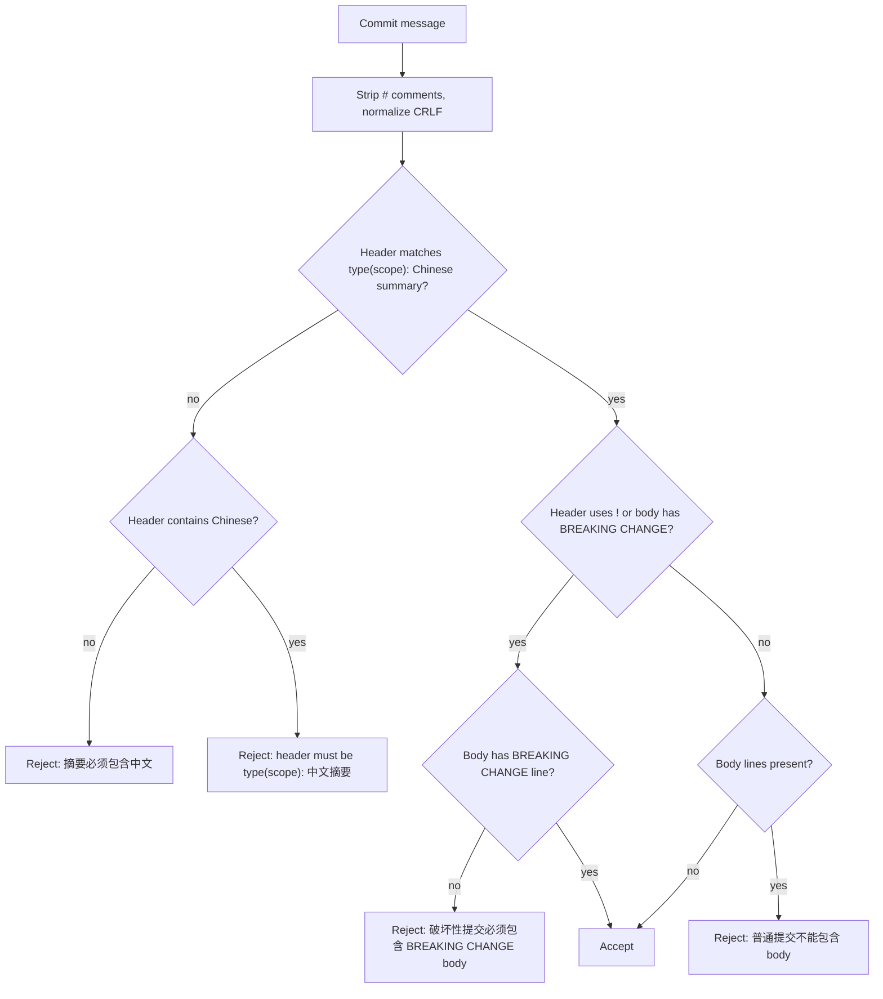

# Commit Message Validation

Every commit must satisfy two independent validators run by the `commit-msg` husky hook (see [Git Hooks and CI](/openwiki/tooling/hooks-and-ci.md)): `commitlint --edit` (Conventional Commits parsing, configured in `commitlint.config.js` with `@commitlint/config-conventional`) and the project's custom validator [scripts/validate-commit-message.mjs](/scripts/validate-commit-message.mjs). The custom validator encodes rules that commitlint cannot express: the Chinese summary requirement and the normal-commit-no-body rule.

## Rules

- **Header shape**: `type(scope): 摘要` where `type` is one of `feat|fix|docs|style|refactor|perf|test|build|ci|chore|revert` and `scope` is lowercase letters, digits, and hyphens (`[a-z0-9][a-z0-9-]*`).
- **Chinese summary**: the header must contain at least one CJK character in the range `[\u3400-\u9fff]` (the validator reports 摘要必须包含中文 when missing).
- **Normal commits**: header only — any non-comment body line is rejected (普通提交不能包含 body).
- **Breaking commits**: the header marks `!` after the scope (`type(scope)!:`) and the body must contain a line matching `^BREAKING CHANGE:\s+\S+`. Missing body → 破坏性提交必须包含 BREAKING CHANGE body.
- **Comments stripped**: lines whose trimmed start is `#` are removed before validation (Git comment lines).
- **CRLF normalization**: `\r\n` is converted to `\n` before splitting.

## Validator implementation

- `validateCommitMessage(message)` is exported for tests. The constants are `COMMIT_TYPES = '(feat|fix|docs|style|refactor|perf|test|build|ci|chore|revert)'`, `HEADER_PATTERN` (full header shape incl. the CJK lookahead `(?=.*[\u3400-\u9fff])`), and `BREAKING_BODY_PATTERN`. `getMeaningfulLines(message)` normalizes `\r\n` to `\n` and strips lines whose `trimStart()` begins with `#` (Git comment lines).
- Error strings: missing CJK → `摘要必须包含中文`; malformed header → `提交信息必须符合 type(scope): 中文摘要，scope 只能使用小写字母、数字和短横线`; breaking commit without body → `破坏性提交必须包含 BREAKING CHANGE body`; body on a normal commit → `普通提交不能包含 body`.
- The script detects CLI mode by comparing `import.meta.url` with `process.argv[1]`; as a CLI it reads the commit message file passed as `argv[2]` and prints the error, exiting 1 on failure. Usage: `node scripts/validate-commit-message.mjs <commit-message-file>`.



*Decision flow of validateCommitMessage in scripts/validate-commit-message.mjs.*

## Unit tests

`tests/unit/validate-commit-message.test.ts` (Vitest) pins five behaviors:

1. Accepts `feat(auth): 添加登录` (normal, Chinese, no body).
2. Rejects a normal commit with a body (throws 普通提交不能包含 body).
3. Rejects a summary without Chinese (throws 摘要必须包含中文).
4. Rejects `feat(api)!: 调整接口` without a body (throws 破坏性提交必须包含 BREAKING CHANGE body).
5. Accepts `feat(api)!: 调整接口\n\nBREAKING CHANGE: 返回结构发生变化`.

Run focused: `pnpm test -- tests/unit/validate-commit-message.test.ts` (see [Unit Testing](/openwiki/testing/unit-testing.md)).

## Examples from the docs

```text
feat(auth): 添加用户登录功能            # OK — normal commit, header only
fix(api): 修复数据请求超时问题           # OK
docs(readme): 更新项目文档               # OK
feat(api)!: 调整文档接口                 # REJECTED — breaking commit needs BREAKING CHANGE body
feat(api)!: 调整文档接口

BREAKING CHANGE: 文档详情响应字段发生变化  # OK
```

## Change surface

- Changing the allowed types, scope charset, Chinese range, or body rules means editing `HEADER_PATTERN`/`BREAKING_BODY_PATTERN` in `scripts/validate-commit-message.mjs` **and** the corresponding expectations in `tests/unit/validate-commit-message.test.ts` (fail-first, per AGENTS.md TDD), and updating docs/guides/development-workflow.md and CONTRIBUTING.md in the same change.
- The `commit-msg` hook wiring lives in `.husky/commit-msg` (commitlint + validator in sequence).
