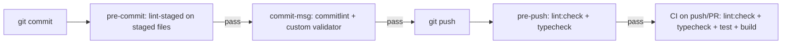

# Git Hooks and CI

The repository enforces a four-layer verification ladder: pre-commit (fast, staged), commit-msg (message), pre-push (cheap full-project), and CI (full parity). Hooks never run Markdown checks, spell checks, or production builds; CI is the only place that builds.

## Husky hooks

| Hook | Script content | What it runs |
| --- | --- | --- |
| `.husky/pre-commit` | `pnpm exec lint-staged` | ESLint --fix + Prettier --write on staged code/CSS files only (config in `package.json` `lint-staged`) |
| `.husky/commit-msg` | `pnpm exec commitlint --edit "$1"` then `pnpm exec node scripts/validate-commit-message.mjs "$1"` | Conventional Commits + the project's custom validator — see [Commit Message Validation](/openwiki/tooling/commit-message-validation.md) |
| `.husky/pre-push` | `pnpm run check:pre-push` | `lint:check` + `typecheck` (no build, no tests) |

`.husky/_` contains husky's generated runtime files and is not hand-edited.

## GitHub Actions — ci.yml

[.github/workflows/ci.yml](/.github/workflows/ci.yml) runs on **push to any branch** and **pull requests**, with `contents: read` only:

1. Checkout `actions/checkout@v4`.
2. Setup pnpm `pnpm/action-setup@v4` (version 10) with Node 22 (`actions/setup-node@v4`, pnpm cache).
3. `pnpm install --frozen-lockfile`.
4. `pnpm run lint:check` → `pnpm typecheck` → `pnpm test` → `pnpm build`.

There is no deployment step anywhere in CI (AGENTS.md: CD not configured; the workflow only responds to push/PR).

## GitHub Actions — openwiki-update.yml

[.github/workflows/openwiki-update.yml](/.github/workflows/openwiki-update.yml) regenerates the repository wiki on `workflow_dispatch` and a daily cron (`0 8 * * *`), with `contents: write` + `pull-requests: write`:

1. Checkout with `fetch-depth: 0` (full history, so `openwiki code --update` can diff against the commit it last documented).
2. Node 22.
3. `npm install --global openwiki@0.3.3 mermaid@11.16.0 jsdom@29.1.1` (mermaid + jsdom enable high-fidelity validation of the wiki's Mermaid diagrams — see [OpenWiki Skills Library](/openwiki/reference/openwiki-skills.md)).
4. `openwiki code --update --print` with `OPENWIKI_PROVIDER=openai-compatible`, `OPENAI_COMPATIBLE_API_KEY`/`OPENAI_COMPATIBLE_BASE_URL` from secrets/vars, `OPENWIKI_MODEL_ID=deepseek-v4-flash`, and optional LangSmith tracing env (`OPENWIKI_LANGSMITH_API_KEY`, `LANGSMITH_API_KEY`, `LANGCHAIN_PROJECT=openwiki`, `LANGCHAIN_TRACING_V2`).
5. `peter-evans/create-pull-request` opens/updates a PR on branch `openwiki/update` (`docs: update OpenWiki`) with `add-paths: openwiki, AGENTS.md, CLAUDE.md, .github/workflows/openwiki-update.yml`.

Implication for contributors: **do not hand-edit generated OpenWiki pages**; update source/docs and let the scheduled workflow regenerate (AGENTS.md OpenWiki section). The workflow requires the repo secrets `OPENAI_COMPATIBLE_API_KEY` and `OPENWIKI_LANGSMITH_API_KEY` to be configured.

## Verification ladder

*Verification gates from commit to CI; each layer is narrower/cheaper than the next.*

## Change surface

- Editing hook commands touches `.husky/*` and/or `package.json` (`lint-staged`, `check:pre-push`) — keep the hooks lightweight and build-free per AGENTS.md.
- Editing CI touches `.github/workflows/ci.yml`; adding deployment would be a deliberate, documented change (currently out of scope).
- The OpenWiki workflow pins openwiki `0.3.3` and mermaid/jsdom versions; updating them changes how the wiki is regenerated and validated.
